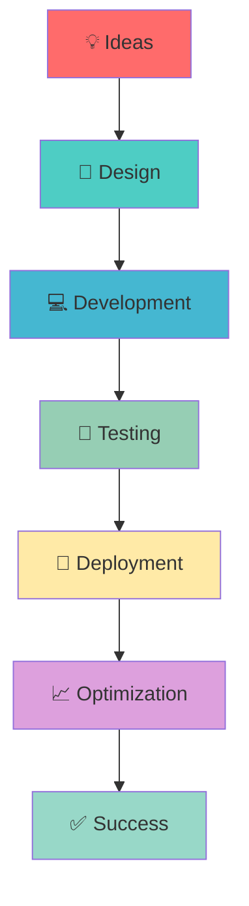

# Hi there! 👋 I'm Sumit Jaiswal

<div align="center">
  


[](https://git.io/typing-svg)

</div>

## 📊 Quick Stats

<div align="center">
  
| 🎯 Experience | 🚀 Projects | 💻 Technologies | 🏆 Success Rate |
|:-------------:|:-----------:|:----------------:|:----------------:|
| **5+ Years**  | **70+ Apps** | **15+ Techs**   | **100%**        |

</div>

## 🚀 About Me

```javascript
const sumit = {
    name: "Sumit Jaiswal",
    role: "Full Stack Software Developer",
    location: "Lucknow, India",
    experience: "5+ years",
    
    expertise: {
        backend: ["PHP", "Laravel", "CodeIgniter", "Node.js"],
        frontend: ["JavaScript", "React", "Vue.js", "HTML5", "CSS3"],
        databases: ["MySQL", "Firebase"],
        cloud: ["AWS", "Google Cloud Platform", "Docker"],
        tools: ["Bubble.io", "Payment Gateways", "Push Notifications"]
    },
    
    currentFocus: "Building scalable web applications and APIs",
    funFact: "I've built 70+ websites and love turning ideas into reality! 🎨"
};
```

## 💼 Professional Experience

### 🏢 **Software Developer** | *Jamtech Technologies Pvt Ltd*
`Jun 2023 - Present`
- 🔧 Spearheaded software maintenance and API development
- ☁️ Deployed projects on AWS servers
- 📈 Managed multiple projects concurrently with enhanced performance

### 🏢 **Software Developer** | *Gautam Tech Solutions*
`Jun 2022 - Jun 2023`
- 🛠️ Managed multiple software systems and added new modules
- 🎛️ Handled CPanel management and application maintenance

### 🏢 **Full Stack Developer** | *Bhavya Technologies Pvt Ltd*
`Aug 2020 - Sep 2021`
- 🎨 Created beautiful websites and web applications
- 🔄 Worked on frontend, backend, logo design, and SEO

### 🏢 **PHP Web Developer** | *Sam Softech Consultancy Pvt Ltd*
`Feb 2019 - Mar 2020`
- 🌐 Developed 70+ beautiful websites
- 💻 Focused on PHP backend and frontend development

## 🛠️ Tech Stack

<div align="center">

### Backend Development


### Frontend Development


### Cloud & DevOps


### Tools & Platforms


</div>

## 🎯 Featured Projects

<div align="center">

### 🎓 **GyanPeeth** | *College Management System*
`Duration: 12 Months`
</div>

📚 **College management software** serving Gautam Group with features like:
- 👥 Student enrollment and attendance tracking
- 📊 Dynamic grade management and analytics
- 🎛️ Comprehensive administrative dashboard
- 📈 Streamlined communication system

**Tech Stack:** `PHP` `Laravel` `MySQL` `Admin Panel`

---

<div align="center">

### 👼 **Guardian Angel** | *Location Tracking App*
`Duration: 15 Months`
</div>

📍 **Mobile application** for child safety and location tracking:
- 🗺️ Real-time location monitoring
- 🛤️ Custom route creation and path guidance
- 🚨 Automated deviation alerts for parents
- 📱 Cross-platform mobile application

**Tech Stack:** `WordPress` `Google Maps API` `Mobile Development`

---

<div align="center">

### 🏨 **Book Your Own** | *Online Travel Agency*
`Duration: 8 Months`
</div>

✈️ **OTA platform** from Punjab, India for hotel bookings:
- 🏨 Comprehensive hotel booking system
- 🔗 Third-party channel manager integrations (Staah, Axis)
- 💳 Secure payment processing
- 📊 Advanced booking analytics

**Tech Stack:** `Laravel` `Vue.js` `Angular` `MySQL`

---

<div align="center">

### 🎯 **PitchPrfct** | *Lead Communication Automation*
`Duration: 10 Months`
</div>

🤖 **Automation application** for streamlined lead communication:
- 🔄 Custom workflow automation
- 📁 Advanced contact management system
- 💬 One-to-one chat functionality
- 📢 Bulk messaging capabilities

**Tech Stack:** `Bubble.io` `No-Code Development` `Automation`

---

<div align="center">

### 🔧 **Onleetech** | *Technical Services Platform*
`Duration: 3 Months`
</div>

👨‍💻 **Online platform** connecting customers with qualified technicians:
- ⚡ Real-time technician matching
- 💳 Subscription model with KYC verification
- 📹 Video calls with remote access
- 📱 Progressive Web App (PWA)

**Tech Stack:** `Vue.js` `Laravel` `PWA` `Video Integration`

## 📈 GitHub Analytics

<div align="center">
  


</div>

## 🎓 Education

| Degree | Institution | Year | Location |
|:------:|:-----------:|:----:|:--------:|
| **MCA** | Patliputra University | 2023 | Bihar |
| **BCA** | TPS College, Patna | 2018 | Bihar |

## 🌟 What I Do Best

<div align="center">



</div>

### 🎯 Core Competencies

- 🏗️ **Full Stack Development** - End-to-end web application development
- 🔌 **API Development** - RESTful services and third-party integrations
- ☁️ **Cloud Deployment** - AWS and Google Cloud Platform expertise
- 👥 **Team Leadership** - Agile methodologies and project management
- 🤝 **Client Communication** - Requirement analysis and solution design
- 🔄 **DevOps** - CI/CD pipelines and containerization with Docker

## 🏆 Achievements & Highlights

<div align="center">

| 🎯 Achievement | 📊 Metric |
|:-------------:|:---------:|
| **Projects Completed** | 70+ Websites |
| **Client Satisfaction** | 100% Success Rate |
| **Technologies Mastered** | 15+ Tech Stack |
| **Team Projects Led** | Multiple Concurrent |
| **API Integrations** | Payment Gateways, Maps, etc. |
| **Code Quality** | Clean, Scalable, Maintainable |

</div>

## 🎨 Personal Interests

<div align="center">

🏏 **Cricket Enthusiast** | 🏊‍♂️ **Swimming** | 🌍 **Traveling** | 💻 **Tech Innovation**

</div>

## 📞 Let's Connect & Build Something Amazing!

<div align="center">

[](mailto:someitjaiswal.sj.97@gmail.com)
[](tel:+917323837297)
[](https://goo.gl/maps/lucknow)

### 🤝 Open for Collaboration

💼 **Available for:** Full Stack Development | API Integration | Cloud Deployment | Technical Consulting

🎯 **Interested in:** Innovative Projects | Startup Ventures | Open Source Contributions

</div>

---

<div align="center">

### 💭 Philosophy

*"Code is like humor. When you have to explain it, it's bad."* 

**Building the future, one line of code at a time! 🚀**


</div>

---

<div align="center">


**⭐ Star my repositories if you find them interesting!**

*Ready to turn your ideas into reality? Let's connect and create something extraordinary together!* ✨

</div>
